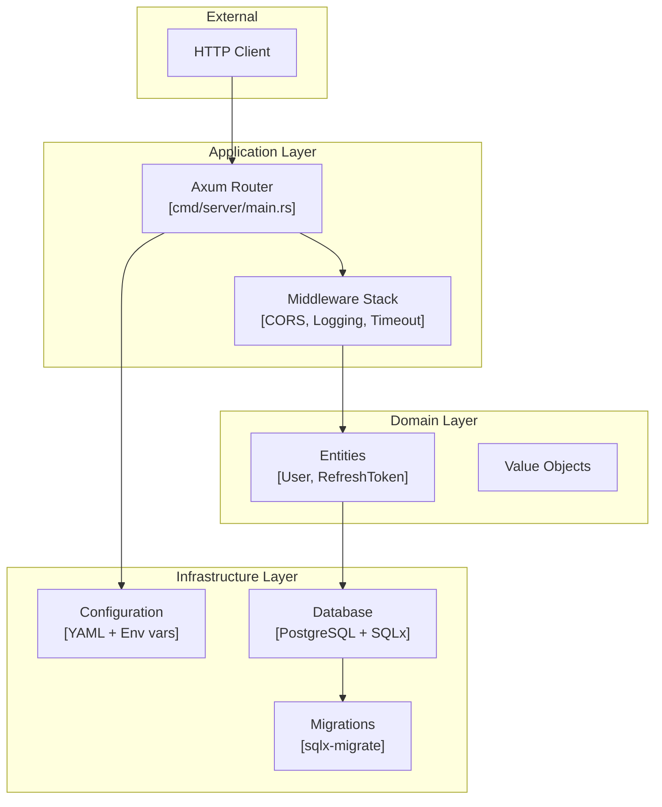
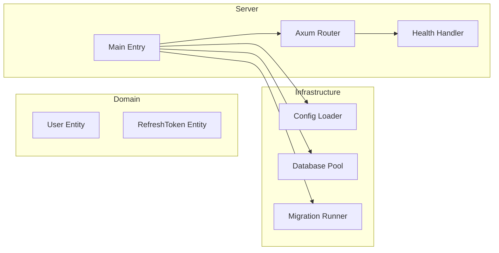

# Architecture: Zercle Rust Template

## High-Level Architecture



## Layer Structure

### 1. Domain Layer (`src/internal/domain/`)
**Purpose**: Core business logic, independent of frameworks

**Components**:
- **Entities**: Business objects with identity
  - `User`: Email, password hash, profile data
  - `RefreshToken`: Token storage for JWT refresh flow
- **Value Objects**: Immutable objects without identity
- **Domain Services**: Business operations spanning multiple entities

**Rules**:
- No external dependencies (framework-agnostic)
- Pure Rust with standard library + domain types
- Contains business invariants and validation logic

### 2. Application Layer (Future: `src/internal/application/`)
**Purpose**: Orchestrate use cases, coordinate domain and infrastructure

**Planned Components**:
- **Use Cases**: Single-responsibility operations
  - User registration
  - User authentication
  - Token refresh
- **DTOs**: Request/response data structures
- **Services**: Application-specific business logic

**Rules**:
- Depends on domain layer
- Coordinates infrastructure for persistence
- No direct framework dependencies

### 3. Infrastructure Layer (`src/internal/infrastructure/`)
**Purpose**: Technical capabilities and external integrations

**Components**:
- **Configuration** (`config/`):
  - Environment-based config loading
  - YAML file + environment variable override
  - Type-safe configuration structs
- **Database** (`db/`):
  - PostgreSQL connection pooling
  - Migration runner
  - Connection management

**Rules**:
- Implements interfaces defined by domain/application
- Contains all external dependencies (SQLx, Axum, etc.)
- Adaptable to framework changes

### 4. Presentation Layer (`cmd/server/`)
**Purpose**: HTTP interface, request handling

**Components**:
- **Main**: Application bootstrap
- **Routes**: HTTP endpoint definitions
- **Handlers**: Request processing logic

**Rules**:
- Thin layer, delegates to application services
- Handles HTTP-specific concerns (headers, status codes)
- No business logic

## Data Flow

### Request Flow
```
HTTP Request → Router → Middleware → Handler → Use Case → Domain → Repository → Database
```

### Response Flow
```
Database → Repository → Domain → Use Case → Handler → Middleware → HTTP Response
```

## Database Schema

### Tables

**users**
| Column | Type | Constraints |
|--------|------|-------------|
| id | UUID | PRIMARY KEY, auto-generated |
| email | VARCHAR(255) | UNIQUE, NOT NULL |
| password_hash | TEXT | NOT NULL |
| full_name | VARCHAR(255) | NULL |
| created_at | TIMESTAMP | NOT NULL, DEFAULT NOW() |
| updated_at | TIMESTAMP | NOT NULL, DEFAULT NOW() |

**refresh_tokens**
| Column | Type | Constraints |
|--------|------|-------------|
| id | UUID | PRIMARY KEY, auto-generated |
| user_id | UUID | FOREIGN KEY → users(id) |
| token | TEXT | NOT NULL |
| expires_at | TIMESTAMP | NOT NULL |
| created_at | TIMESTAMP | NOT NULL, DEFAULT NOW() |

**Indexes**:
- `idx_refresh_tokens_user_id`: Fast lookup by user
- `idx_refresh_tokens_token`: Fast token validation

## Component Diagram



## Scalability Considerations

### Horizontal Scaling
- Stateless server design (session data in JWT)
- Database connection pooling configured per instance
- No in-memory state between requests

### Performance
- Connection pooling (max 25 connections default)
- Prepared statement caching via SQLx
- Configurable compression middleware
- Request timeout middleware ready

### Future Scalability
- Repository pattern enables database sharding
- Domain layer supports event sourcing if needed
- Clean Architecture allows service extraction
